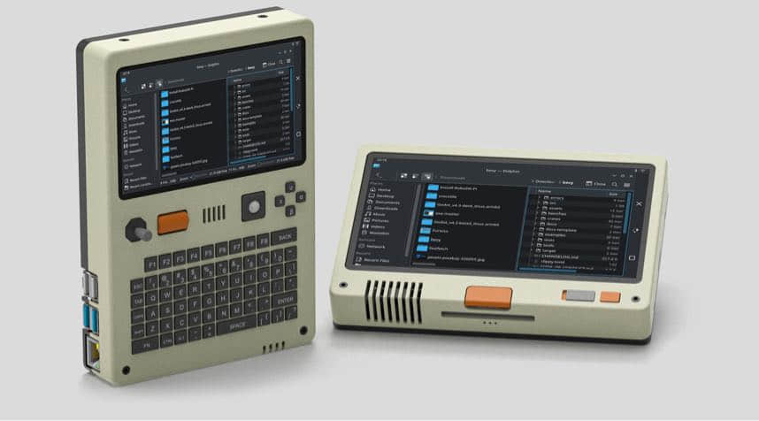
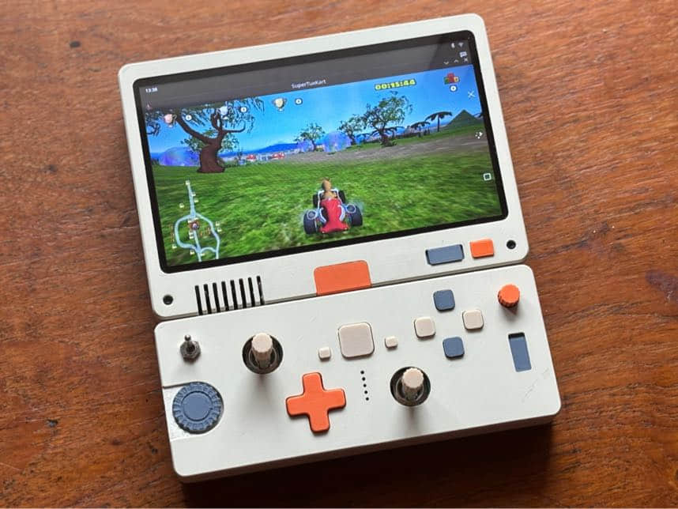
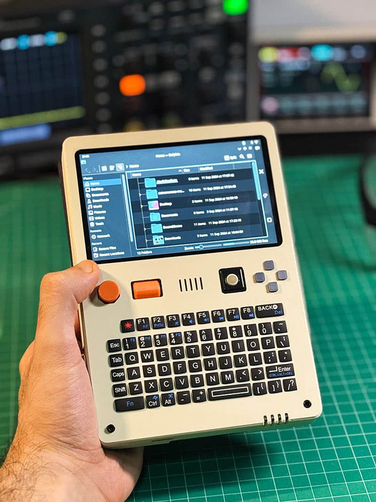
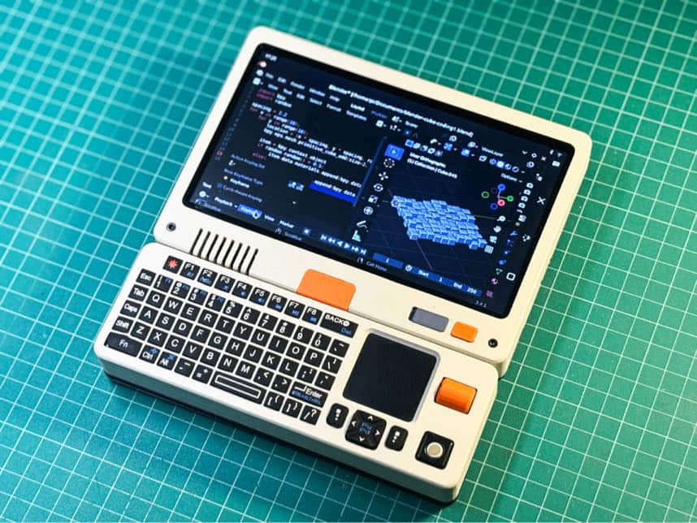

最近，我朋友遇到将数据库每日备份到办公室nas的场景，**办公室没有常年开机的电脑，而且全是Windows**，我能想到最好的方案就是，接一块树莓派，然后装了Linux的树莓派通过smb服务挂载办公室nas，每天定时将数据库备份到本地，**运行稳定，且节能**。

海外的开发者将树莓派也是玩出了花，配一块屏幕，装一块电池，配上全尺寸键盘触控板，想怎么玩就怎么玩。

安装**手柄组件，是游戏机；安装键盘，就是运维神器；装个网卡组件，就是自带续航的户外软路由**；

官网 https://soulscircuit.com/pilet

这款小电脑，基于目前性能最强的树莓派5进行开发，能效比也是树莓派里最好的，电池能提供**7个小时的续航**，基本与智能手机的续航相仿。

我认为这是很好的潮玩，用户购买不同的外设，就能**解锁**不同的功能，**有点像switch，但系统基于Linux，比switch更开放**！

官方目前放出的配件，也是非常有设计感，**即使作为摆件，也属于常有人问哪里买的类型**，以潮玩的定价逻辑，产品有一些溢价，目标用户也能接受。

树莓派这款产品，设计之初就面向了**公益教育市场，拥抱开源，利润微薄，体积小巧**，运行稳定，充满了无限进化的基因。树莓派5对比4B，性能提升了一倍，体积没变，甚至可以运行一些参数量不大的大模型，更强的性能，必然能给树莓派带来更大的想象力！

