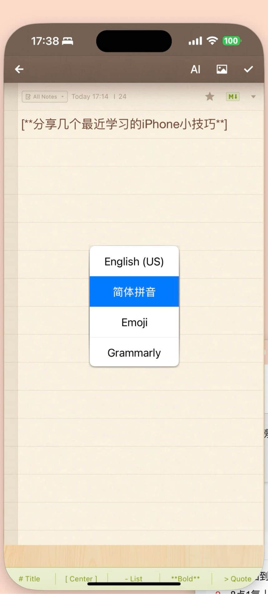
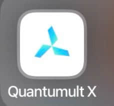

在iPhone Mirroring模式下，在mac按下Fn，即可快速切换输入法。

Quantumult X 是一款可以在iPhone控制网络访问的工具，有两个很实用的功能，一是可以根据wifi名称控制开启VPN，二是可以通过广告屏蔽规则，直接屏蔽iPhone的开屏广告（感兴趣可以查看秋风规则 https://github.com/TG-Twilight/AWAvenue-Ads-Rule）

TG有个很好用的iPhone组件，可以点击直达对应的联系人或群组。

新版的iPhone Mirroring，文本复制粘贴几乎无延迟，同时支持将**macOS的文件直接拖拽到iPhone的App的输入界面**，各种主流类型的文件都可以（pdf，dmg，mp4），**目前iPhone自带的Notes是适配的最好的App**，微信聊天窗口不支持文件拖拽，是微信追求小而美，懒得适配🐶。
