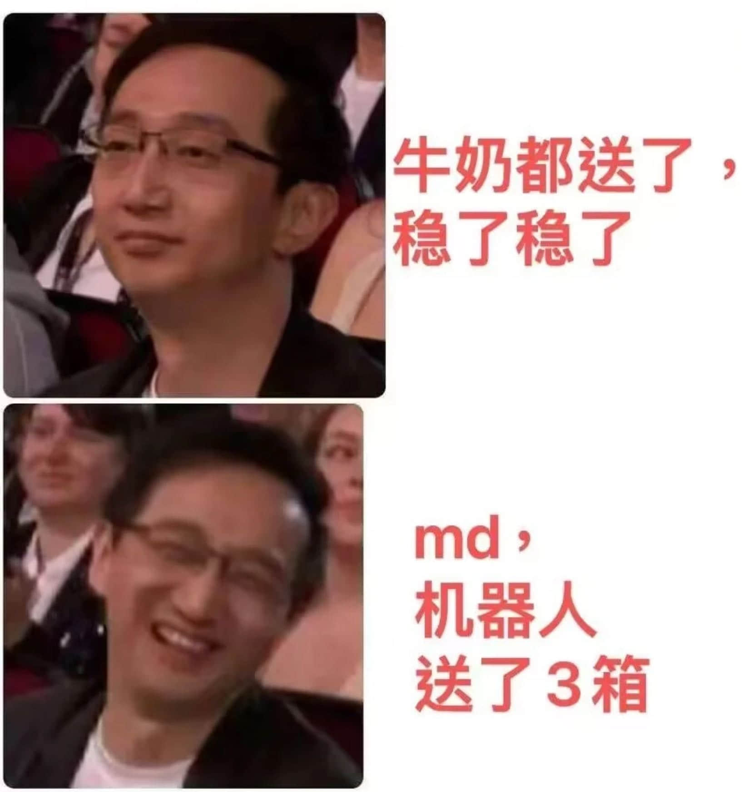

我所在的团队，开发了一个App，在手机上**运行带货平台的PC版后台，通过一些脚本，模拟用户操作，为用户提供，自动回复，自动商品弹窗，并总结平台数据的功能**。同时也把一些声音克隆，话术生成，安卓Xposed的技术融了进去。

这种辅助软件，需要时刻适配各大直播平台的网页结构，**无限接近于实时爬虫，爬虫遇到的问题，这东西全会遇到，而且要进行原生安卓的开发，配合紧俏的开发周期，压力拉满**，而且**毫无行业壁垒，属于典型的脏活儿**。

但这东西在市面上的**定价很高，而且有需求，能赚到钱，能卖硬件，甚至可以搞成订阅制**。如果能搞定销售渠道，也能做成To B的生意。

虽然个人开发者也能开发，但这个软件需要**持续适配网页结构，才能提供稳定的服务**，个人开发者大概率扛不住这种时刻需要更新的开发模式。**最难的是，个人开发者无法搞定销售，卖不出量，就无法覆盖开发成本**。

随着被优化的人越来越多，**人们会体会到真正的工程师红利，被优化的工程师要找点事做，哪怕是很短期的爬虫工程，也可以成为赚钱的生意**。脏活儿能赚钱，人要活着，这种脏活儿对应的技术栈也会变的热门，**比如Xposed，安卓root改机，Kali Hunter**

最近在回看《潜伏》，有段谢若林的金句：**我不反对任何政党，任何主义，但我只信仰生存主义**，在市场经济下，能带来现金流的业务，就是好业务，**没人会在乎工程师是否干脏活儿，工程师也不必追求四平八稳的完美，纠结只会内耗自己，干了再说**！

