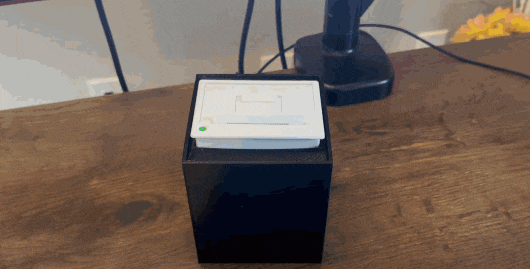

今天看到一个很有趣的迷你打印机产品Guten，它是一台个性化智能小型热敏打印机，它的主要功能是每天早上7:00 自动打印一份"迷你报纸"。这份私人定制的小报纸包含三个主要内容：

1. 用户的每日日程安排（从 Google Calendar 同步）
2. 一首诗
3. 当日新闻（来自纽约时报）

"Guten" 这个名字很可能是向约翰内斯·古腾堡（Johannes Gutenberg）致敬。古腾堡是西方活字印刷术的发明者（比中国晚了近400年）。

这个产品**将现代技术（如云日历、新闻 API）与传统的物理打印相结合**，创造了一种**独特的信息获取体验**。

我翻看了一下国内的mini打印机产品，基本功能集中在打印照片，便签以及错题，这个打印错题的，改良的方向也**很有中国特色**，用户拍照错题，打印机**使用算法消除笔迹，然后把没有笔迹的错题打印出来**，方便学生重做题目！ 

这个打印机适合做个性化信息阅读的增值服务，比如**订阅了一年内容平台的会员，如果只是收看图文消息，也没什么仪式感**，送一个小打印机，**内容实时打印出来，配合个性化水印，就体验感拉满，相当于实体的报纸，让用户感觉花的钱真值**！ 

互联网经常因为一些奇奇怪怪的原因，丢一些有价值的信息，而**基于打印机的内容分发服务，像是一个物理内容区块链**，给用户留底的权利，**删服务器一篇文章很容易，把机器打印出来的纸条销毁，难度可就大的多了**。

产品官网：https://amanvir.com/guten

