加密猫（https://www.cryptokitties.co/） 是一款基于NFT（数字藏品）的游戏，通过产仔，生成更好看的猫猫。

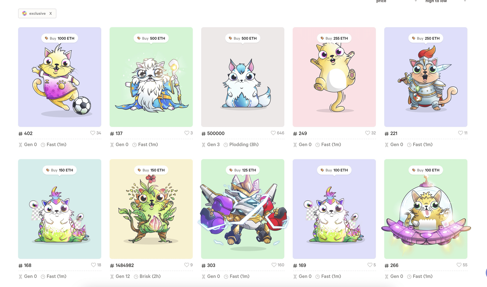

优质的猫猫价格不菲，打开OpenSea交易市场, 查看真实的交易价格，一只猫可以卖到246个ETH,  2025年2月15日，ETH的价格为2700刀，也就是一只猫卖到了66万刀。

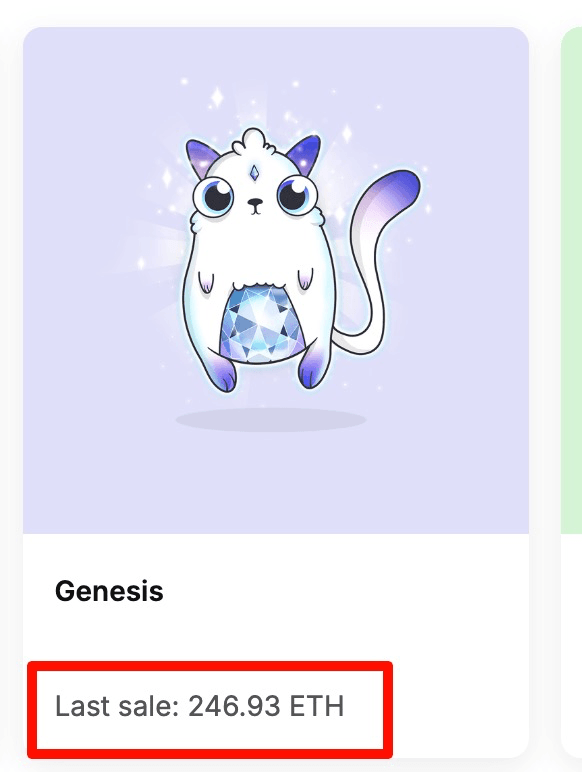

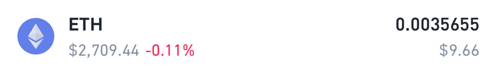

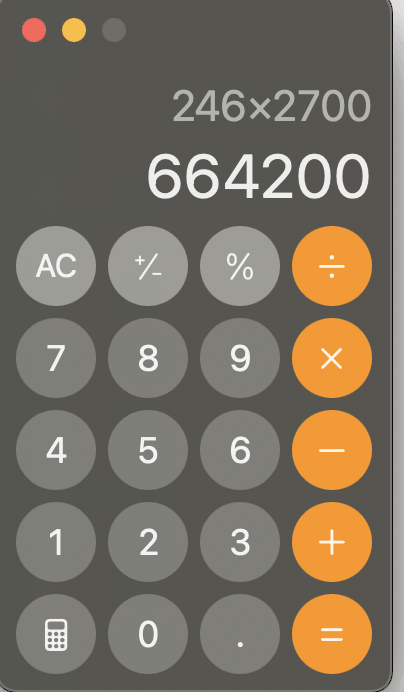

每个猫猫都是NFT数字藏品，可以通过类似OpenSea的平台，进行交易，交易的账户基于匿名加密钱包，和比特币一样，无法定位具体的持有者。

## 加密猫是款赌狗游戏

每次融合猫猫需要，支付0.008ETH的费用，但市场上价格最低的猫，只卖0.0014ETH, 相当于投入8块钱，只能卖1块4，而且还卖不出去。

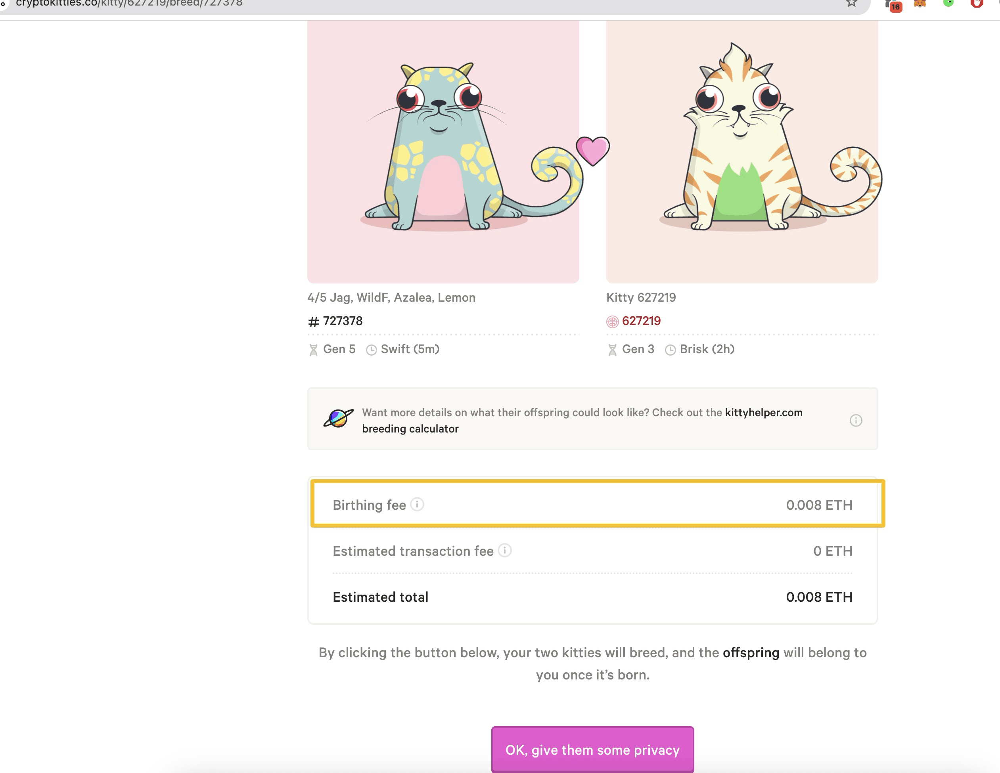

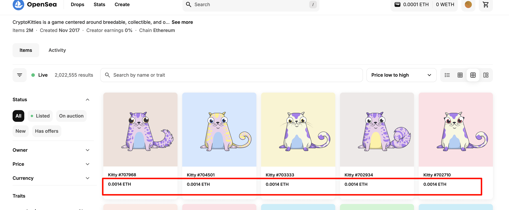

## 如何玩转NFT游戏加密猫？

**如果只是想体验玩法，官方提供了免费版的加密猫**，https://allthezen.cryptokitties.co/ 可以直接通过Telegram进行游玩，免费送蛋，蛋里有猫（我就好奇了，猫不是哺乳动物么！），体验多种玩法，但目前还没有提供交易的途径。

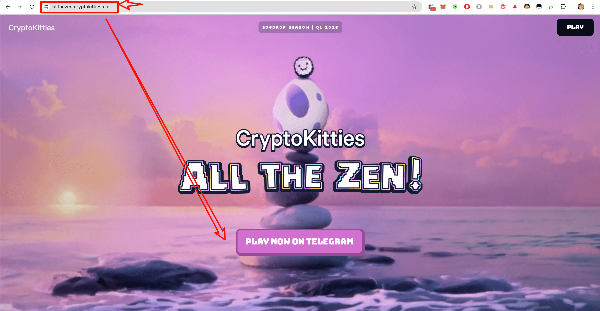

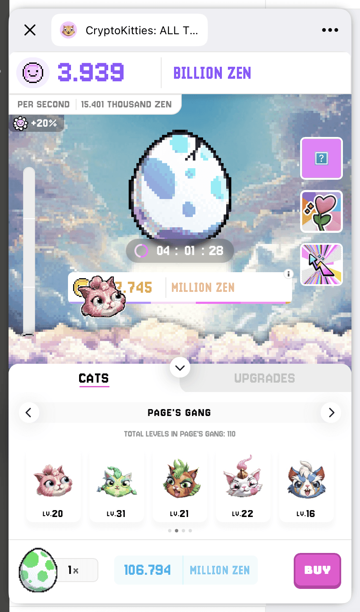

如果想玩赌狗版的加密猫，首先需要购买以太坊的ETC（可以到币安平台购买），购买ETC后, 可以发送到自己的钱包.

这里注意，将ETC往钱包发送时，一定要使用ERC20网络进行发送! 一定要使用ERC20网络进行发送! 一定要使用ERC20网络进行发送!  如果使用币安默认的BEP20网络就无法在OpeaSea买猫。

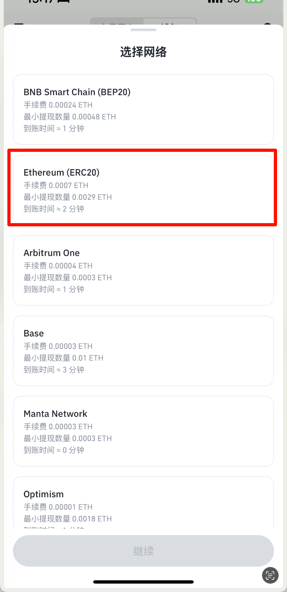

## 币安的坑爹往事

（我被币安坑了10刀，虽然理论上可以BEP20跨链到ERC20，但跨链后的ETC数量要打九折，而且需要额外支付BNB燃料费，最坑爹的是支付了燃料费还会跨链失败，而且0.5刀的BNB燃料费不退还）

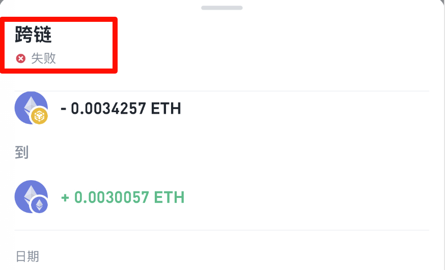

## 赌狗版加密猫和免费版加密猫的数据互通

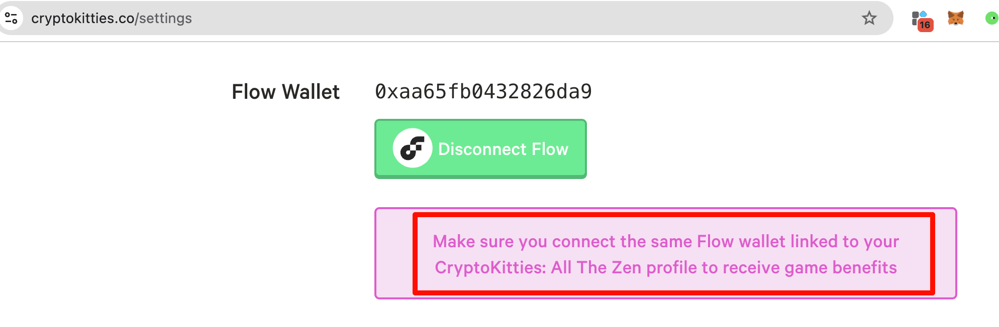

按照官方的说法，如果在赌狗版加密猫买了猫（10美刀能买两只），在免费版加密猫里面会有额外的加成，类似于开通了QQ会员服务，QQ等级成长速度可以从每日1天变成每日1.1天（企鹅遥遥领先）。

这个免费版的加密猫，其实也不是完全免费，它可以使用Telegram点数购买提升游戏体验的道具，Telegram点数类似于QQ币，可以通过使用现实的货币直接购买。

## 为什么要搞免费版加密猫？

免费版的加密猫，在telegram的的月活有接近9万人，哪怕只有百分之一的转化，也能让900人进入赌狗专场。

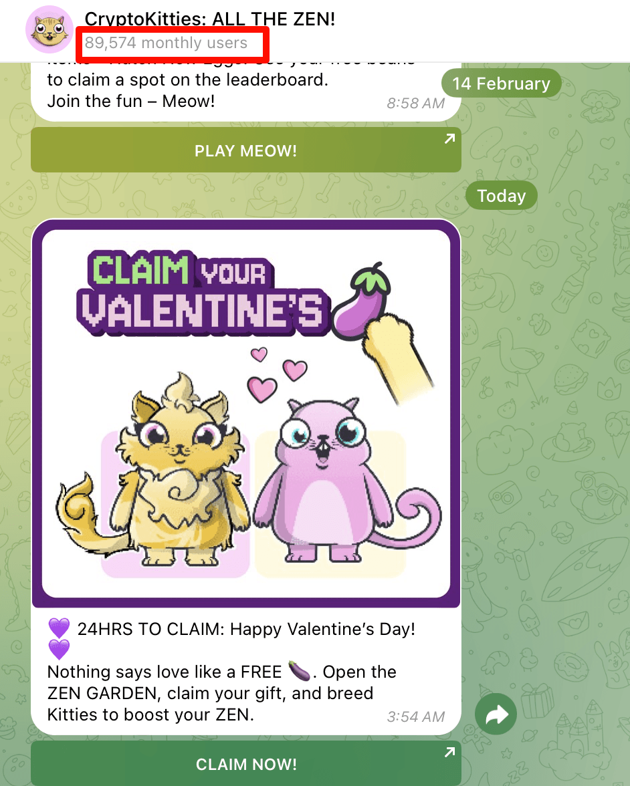

**赌狗专场，就是不断繁殖新猫，而繁殖新猫，起码需要两只猫才能完成**，按照目前的行情，**购买两只最便宜的猫，也要消耗10美元**。**每次繁殖需要0.008ETH,  换算一下，最少需要21美刀才能抽一次卡**!  (算上各种燃料费，实际花费一定会更高)

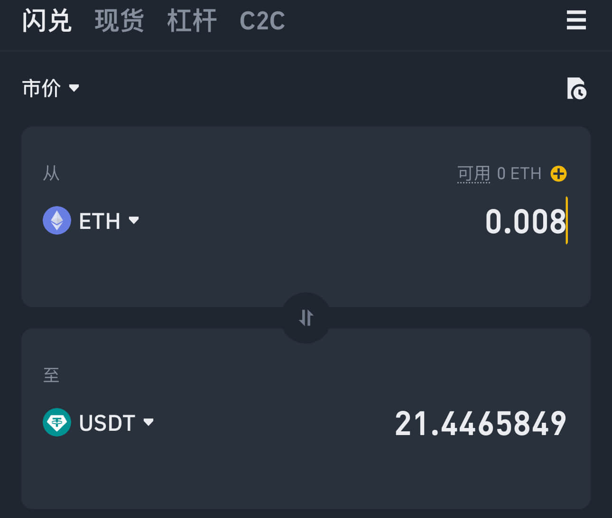

朋友评价：「**氪成这样也有这么多人玩吗**？」

## 小结

**好奇心害死猫，也会让加密猫主人钱包空空**。

无论是免费版还是赌狗版，加密猫的美术确实很漂亮，赌狗版加密猫基于区块链，不会丢数据，如果剥离赌狗属性，开发一款**基于区块链的赛博养成游戏，只要互联网存在，游戏数据就是传家宝**。

