今天是2025年5月，Midjourney在AI产图美学方面的造诣，依然是独树一帜，尤其是v7版本，生图越来越有艺术感。

## 别比比，好不好看？直接上图

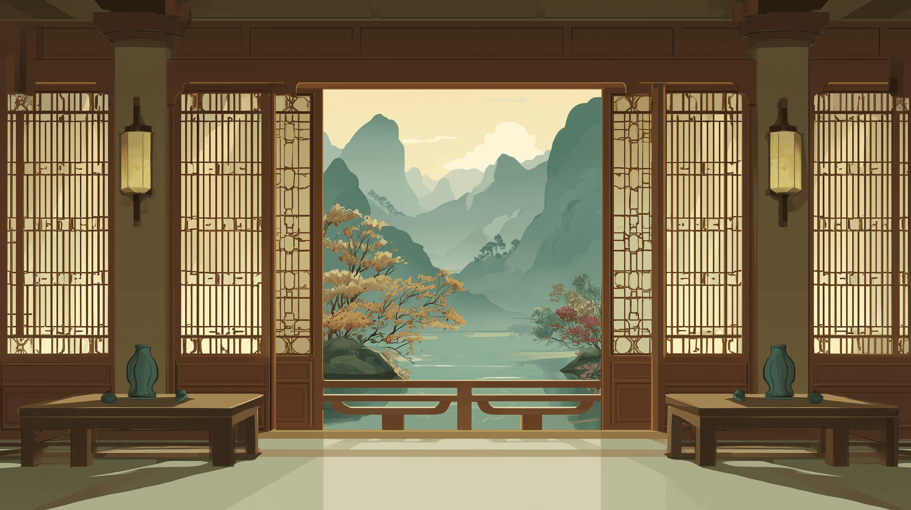

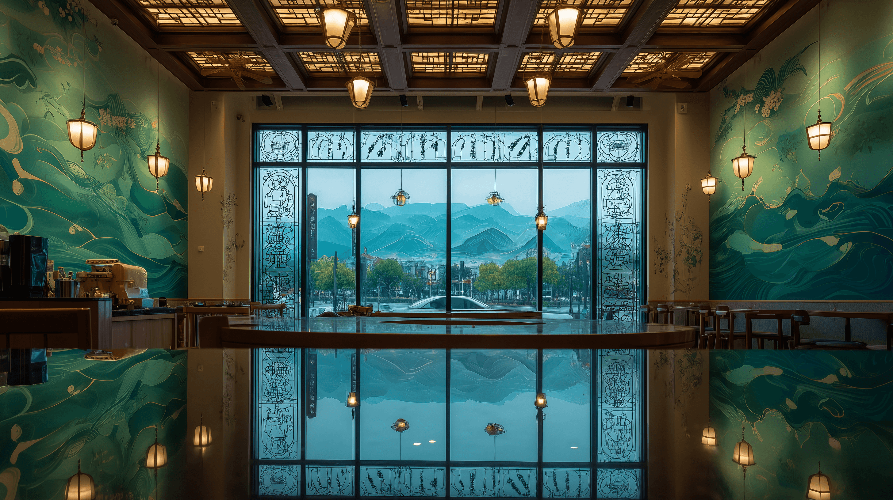

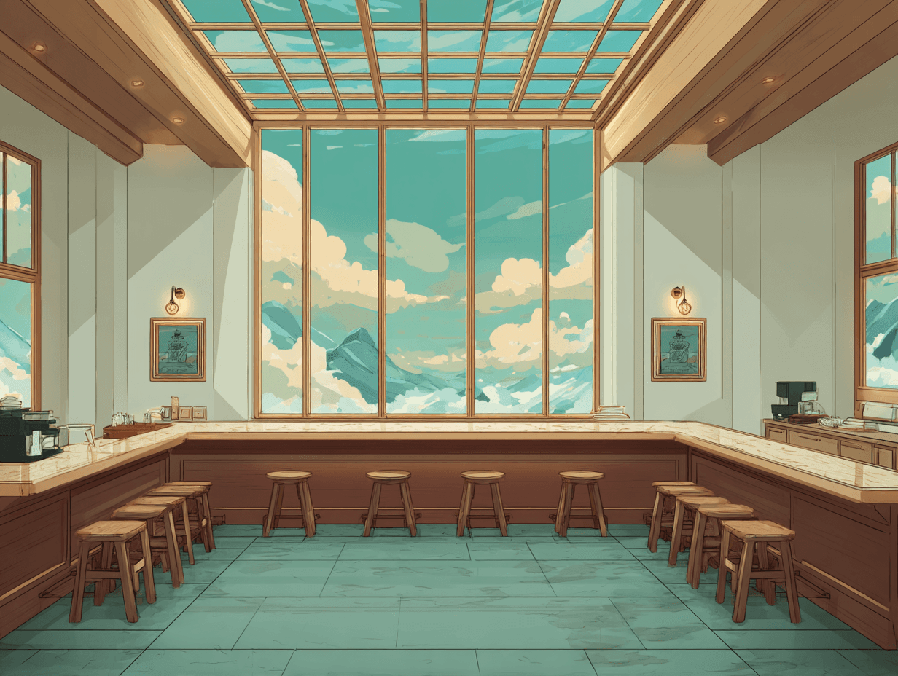

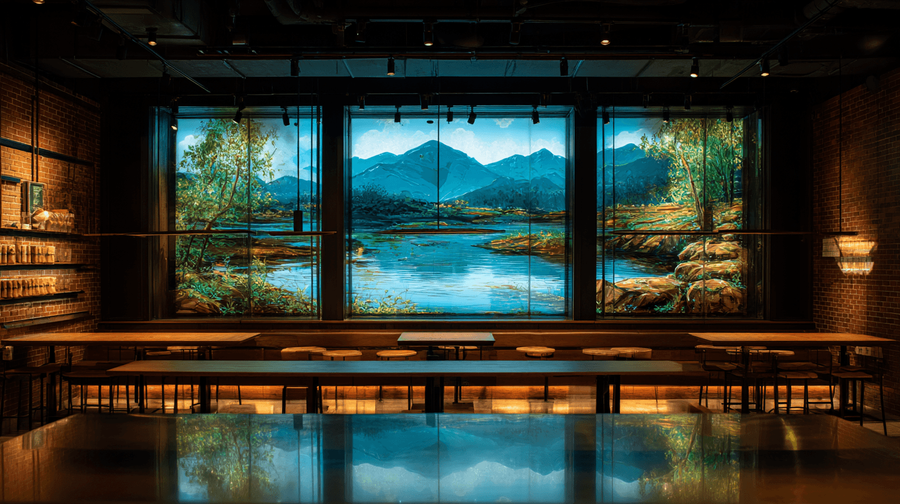

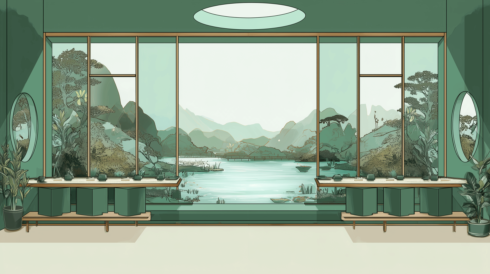

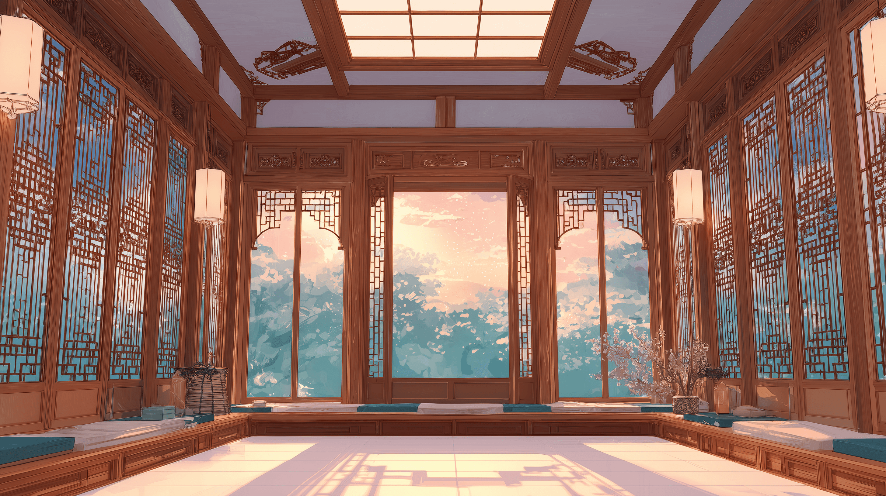

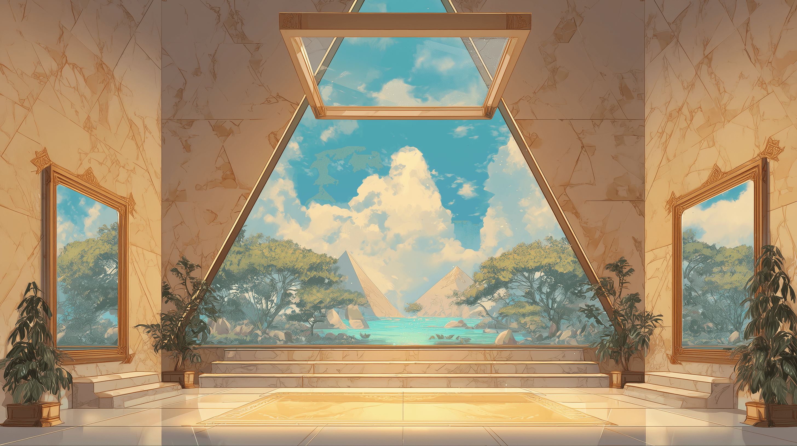

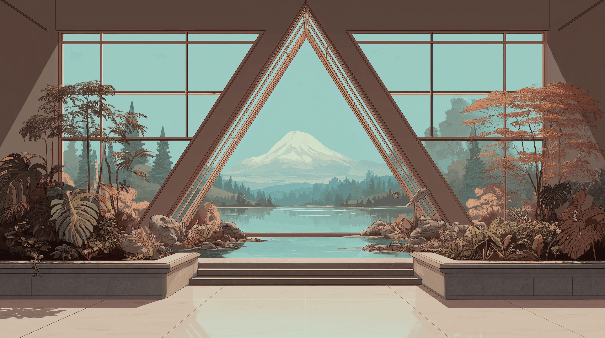

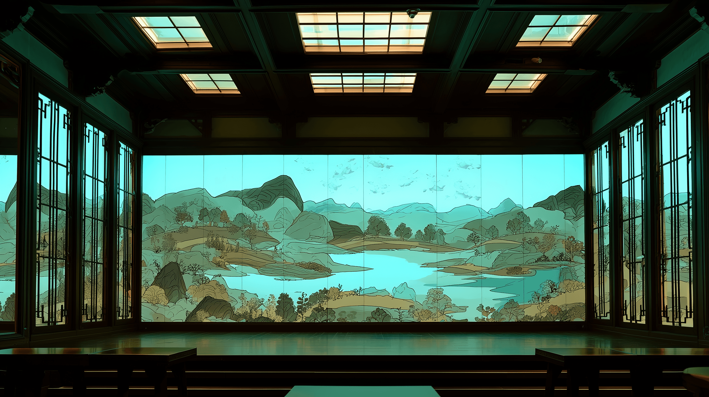

## 还有一些桌面摆件的配饰

龙龟

文昌塔

## 放到实际项目中的效果

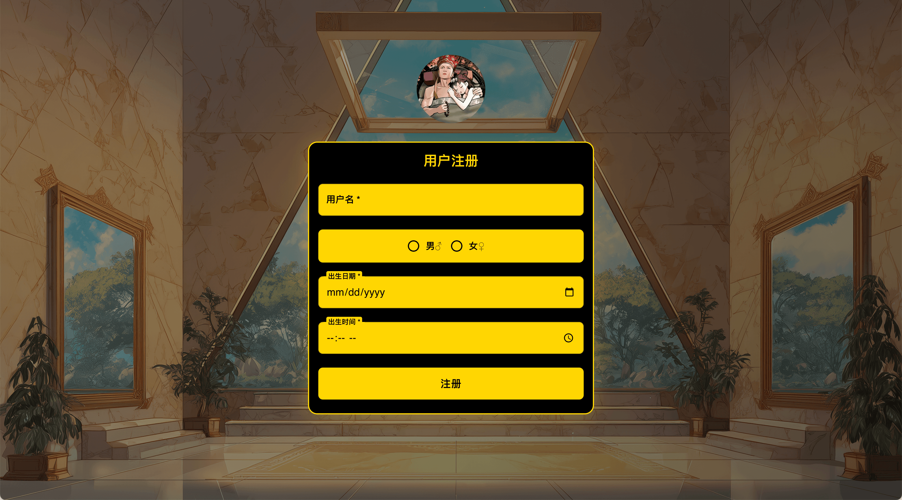

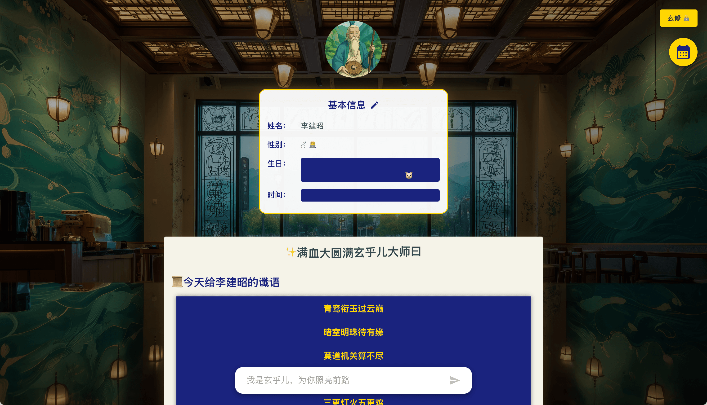

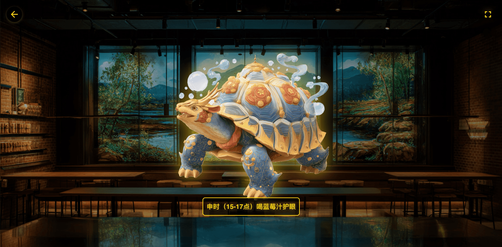

## Midjourney最近的一些进步和存在的问题

Midjourney可以用国内支付宝直接支付了，我订阅了一个月，30刀买了15小时的快速生图，平均每天可以玩半个小时，适合在刷剧的时候，生图抽奖，快乐加倍。

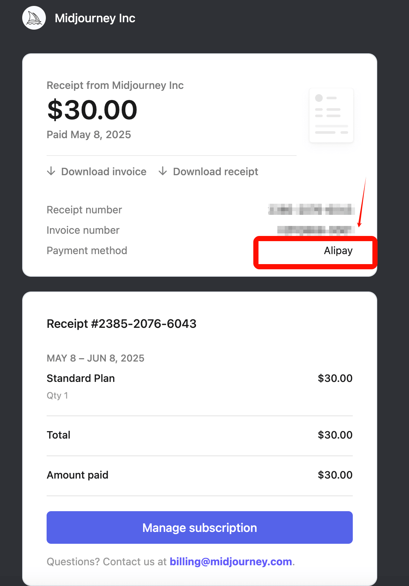

Midjourney 的Web版很好用，即使没有Discord也可以玩好Midjourney, 目前支持了中文提示词，可以直接聊天生图，甚至可以直接中文语音控制生图，

Midjourney 无法直接输出PNG, 小摆件图片需要手动抠除背景图才有好的展示效果，我的方案是配合 photopea.com 在线工具，使用魔棒工具工具自动抠图。

Midjourney到了v7版本，无法支持中文字符，英文字符如果很长，就会出现丢字母的情况，在合成人物方面，人物的手指依然会有一些问题 ↓

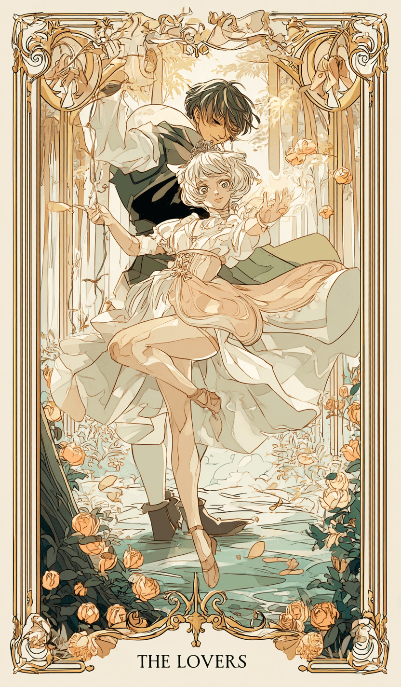

## 小结

对于平面设计师而言，Midjourney 代表的AI生图工具成了一门必修课，Midjourney或许做不出100分的作品，但70分的作品，可以通过调优的提示词，批量快速产出。

对于小公司而言，前期创建的小项目，可以用ChatGPT写提示词，然后让Midjourney生图，真的是性价比超高。量大管饱，且没有版权问题。

