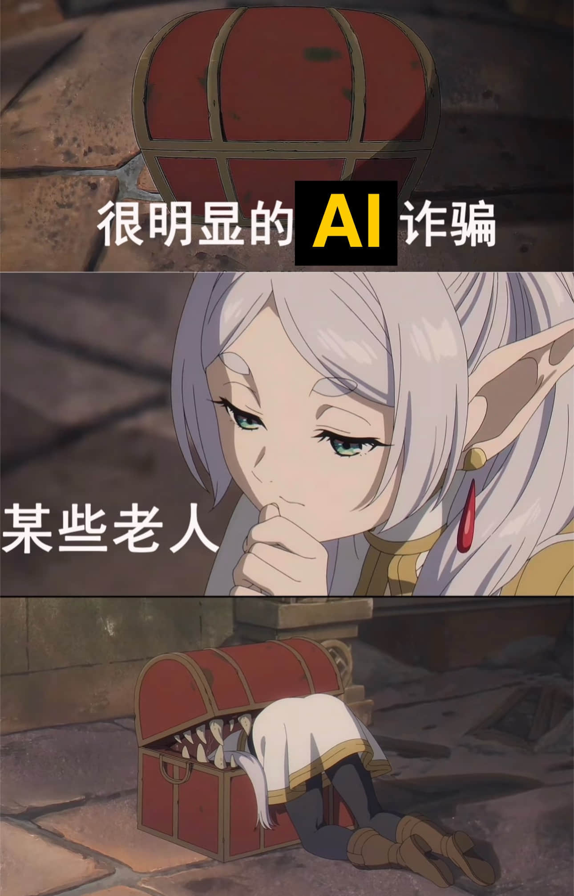

在**金融行业**经常听到一句话，机器无法取代**合规部门**，因为**机器不能代替人坐牢**。

**AI不能代替人类写提示词**，Cursor配合Claude已经可以让**程序员不写一行代码，就能完成开发任务**，但**完成任务的前提是，写大量的提示词**！我以前每天要花**4个小时写码**，现在同样的需求，要花**1个小时写提示词，1小时等待AI反复生成代码，1小时Review代码，1小时Debug**

**AI不适合做技术选型**；如果要求AI做技术选型，AI总是倾向于推荐最热门的技术，而资深的工程师会更多考虑综合开发和维护成本，选型搞错了，AI会把项目改的难以维护，最后还**需要人类工程师清理shi山代码**。

// When I wrote this, only AI and I understood what I was doing.
// Now, AI only knows.

上面☝️这段话的原句是，当我写代码的时候，只有上帝和我知道为什么我那样做，现在只有上帝知道了🐶；我把上帝改成了AI

**AI不适合评审需求的优先级**，说白了，就是不适合分轻重缓急，**无法甄别哪些是伪需求，哪些是真需求**，资深开发团队做需求评审，总是会**问需求背景，然后根据实际情况给出优先级**，但AI无法理清这些细节，全盘接受，然后**生成大量可能包含隐藏bug的代码，搞得人类工程师头秃**🫥！

**AI喜欢解决直接的问题，从不介意引入新的问题**，遇到稍微复杂的问题，AI可能会粗暴的安装依赖包解决，然后依赖冲突，然后混乱🤪，然后不断Retry，陷入死循环，最后上下文超出限制。

程序员这个**职业的复杂性**，**来自于现实世界需求的复杂性**，以及**需求背后逻辑拆解的复杂性**，而AI编程只是**让写代码变得简单**。

我认为**AI确实让拉低了编程的门槛**，**职业程序员要提升阅读代码的能力**，帮AI修bug，读代码**解决疑难杂症正是资深工程师最标志性的技能**。

我认为未来编程的**趋势**是**90%常规需求的编码留给AI**，复杂bug的解决留给**资深程序员**。

[**程序员的哪些工作不能被AI取代**]

在**金融行业**经常听到一句话，机器无法取代**合规部门**，因为**机器不能代替人坐牢**。

**AI不能代替人类写提示词**，Cursor配合Claude已经可以让**程序员不写一行代码，就能完成开发任务**，但**完成任务的前提是，写大量的提示词**！我以前每天要花**4个小时写码**，现在同样的需求，要花**1个小时写提示词，1小时等待AI反复生成代码，1小时Review代码，1小时Debug**

**AI不适合做技术选型**；如果要求AI做技术选型，AI总是倾向于推荐最热门的技术，而资深的工程师会更多考虑综合开发和维护成本，选型搞错了，AI会把项目改的难以维护，最后还**需要人类工程师清理shi山代码**。

// When I wrote this, only AI and I understood what I was doing.
// Now, AI only knows.

上面☝️这段话的原句是，当我写代码的时候，只有上帝和我知道为什么我那样做，现在只有上帝知道了🐶；我把上帝改成了AI

**AI不适合评审需求的优先级**，说白了，就是不适合分轻重缓急，**无法甄别哪些是伪需求，哪些是真需求**，资深开发团队做需求评审，总是会**问需求背景，然后根据实际情况给出优先级**，但AI无法理清这些细节，全盘接受，然后**生成大量可能包含隐藏bug的代码，搞得人类工程师头秃**🫥！

**AI喜欢解决直接的问题，从不介意引入新的问题**，遇到稍微复杂的问题，AI可能会粗暴的安装依赖包解决，然后依赖冲突，然后混乱🤪，然后不断Retry，陷入死循环，最后上下文超出限制。

程序员这个**职业的复杂性**，**来自于现实世界需求的复杂性**，以及**需求背后逻辑拆解的复杂性**，而AI编程只是**让写代码变得简单**。

我认为**AI确实让拉低了编程的门槛**，**职业程序员要提升阅读代码的能力**，帮AI修bug，读代码**解决疑难杂症正是资深工程师最标志性的技能**。

我认为未来编程的**趋势**是**90%常规需求的编码留给AI**，复杂bug的解决留给**资深程序员**；

未来的某天，你应该可以坐在⽕炉边上，品⼀杯⽩兰地或抽⼀支上好的雪茄， 边上坐着你⼼爱的猎⽝，去品味⼀段**AI编写的深奥的程序 **

