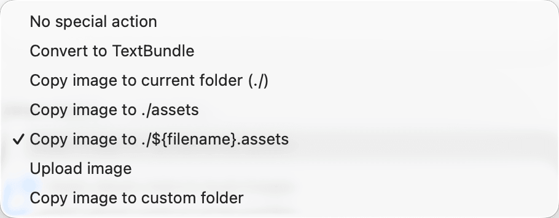
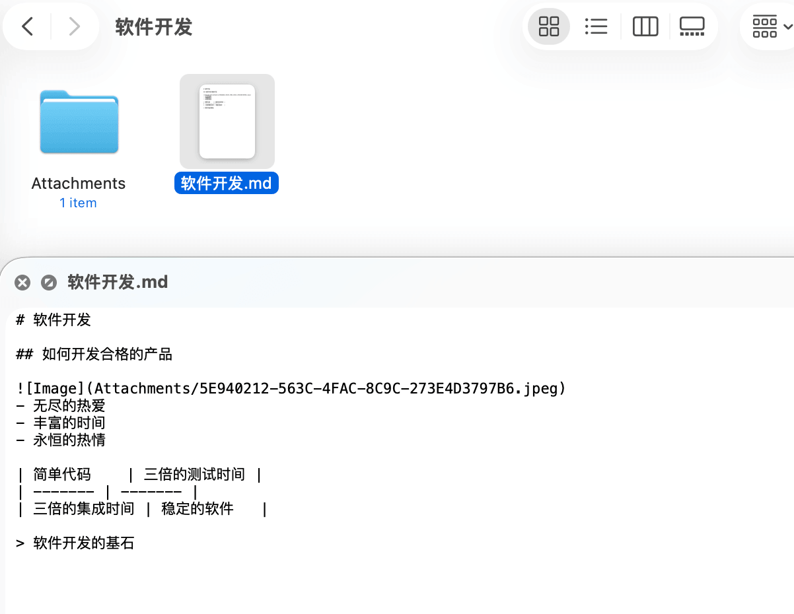
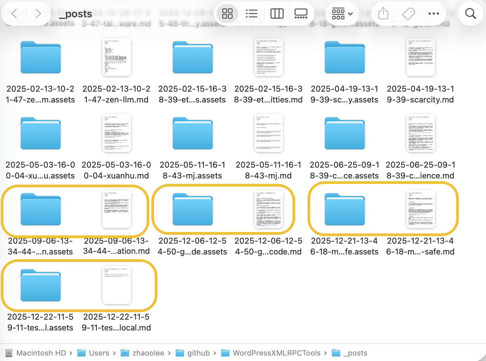

随着博客越写越多，简单优雅地维护博客成了一个不得不考虑的问题，最近在读一些软件工程的**冷门书**，我发现软件工程的思想非常适合用来改造自己的博客系统。

## 文本是最稳定的

Markdown这种标记语言是纯文本的，如果你使用markdown编写内容，你可以在任何时候，通过vim或记事本，对内容进行修改和维护；如果你用word或ppt这种非纯文本格式的文件编写内容，修改的门槛就变高了。

## 软件应减少依赖

写博客需要插入一些图片，这些图片如果是存储到在线图床，那么一旦离线，这篇博客就无法完整阅读了，最好的方式是本地存储，就像typora的方案，在你的博客文件旁边建立一个同名的文件夹，帮你存储图片，博客文件也使用相对位置引用图片，这个图片文件夹和博客文件可以可以被一起打包，通过各种途径分发，如果你不考虑网络分发优化，甚至可以把图片转成字符串直接插入到markdown博客文档。

## 简单就是好

我曾经也很痴迷各种markdown编辑器，它们提供了很多有趣的功能，让码字这件事变得很酷；

我也曾沉迷各种博客美化主题，只要肯花时间，可以让网页变得的非常的文艺小清新；

但是，时间流逝，热情褪去，能让人有动力写博客的，其实就是空闲的时间，以及降低开始写博客的成本，打开手机能用iPhone的备忘录来写，mac可以直接同步接着写，最后直接导出markdown发布，搞定！（没错，看下面这张图，Apple备忘录是支持Markdown导出的！）

## 数据层与表现层应分离

我们写markdown，图片的格式是一个相对路径，但是发布到Wordpress这种标准化网站，却需要一个图片的绝对路径；我们本地文件是数据层，而wordpress展示的是表现层，如果要满足Wordpress的要求，我们应该写一个中间层，这个中间层用来把相对路径转换为绝对路径，这个中间层程序应该在发布文章时运行。

这里我做的就很不好，我当前的博客方案都是在插入图片时，直接通过图床程序把图片转换为url，这样造成了几个问题，一是离线无法查看，而且图片上传过程中不够丝滑，打断思路；二是图床如果出了问题连文章都写不了，三是图床本身的备份成本也是个问题。

如果开始做好数据与表现层的分离，以上三个问题都能自然解决，好的设计本身就可以规避很多问题，如果我们在开发软件过程中，遇到了前人没遇到的问题，我们可以思考一下，是不是设计本身有问题。

## 要抑制分层的贪念

对于绝大多数个人博客而言，为文章加标签就足够管理内容了，如果搞很多的子目录，子目录套子目录，不断分层，那后期维护起来就是一场灾难。

在软件设计过程中，也有抽象层的概念，AI写代码最大的问题之一就是过度分层，看着也无大碍，但是维护起来很困难，出了小问题，要一层层改，甚至要人类程序员手动去删除不必要的抽象层，真的是要命。

## 要把自己当懒人来设计系统

写博客是一种创作，而疲惫的人是无法创作出好作品的，我们不能把博客系统设计的复杂，复杂的系统会让人更快的疲惫。

设计博客系统时，一定要把自己当个懒狗，只管写，未来的维护和迁移都很简单，可以抵御平台政策的干扰，稳定输出，就像写一本小说一样，愉悦自己，帮助他人。

## 我的最终方案

Markdown文章以及关联的图片直接更新到github仓库，github action自动上传到wordpress网站： https://github.com/zhaoolee/WordPressXMLRPCTOOLS

图片文件夹和文章关联，上传到github仓库后，可以触发github action将图片上传到自己的图床https://github.com/zhaoolee/EasyTypora 获取图片链接后，将新的图片链接更新到wordpress，后续可以支持云服务商的图床，满足各种自定义需求

