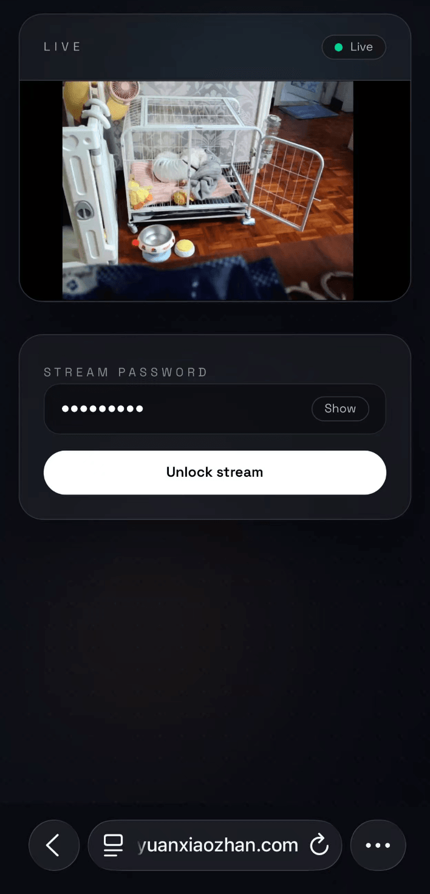
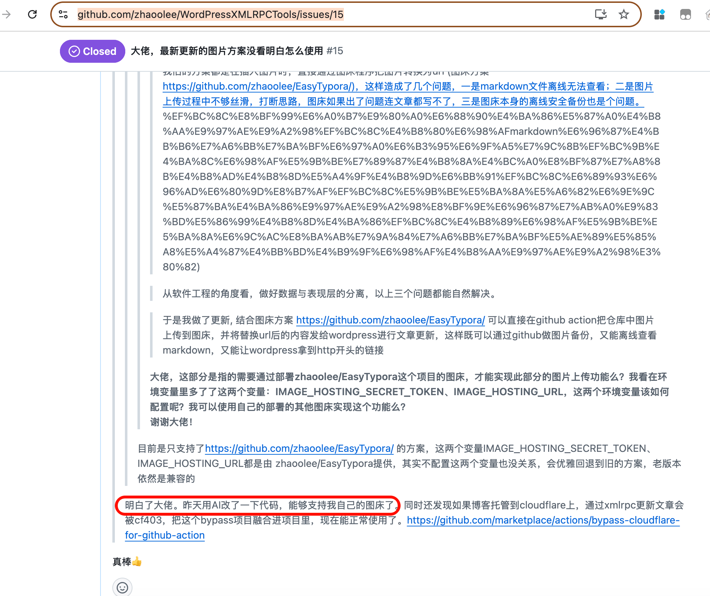

最近工作不太忙，有很多以前想写的代码，终于有时间写了。在使用大模型编程后，我发现**在24小时内完成对想法的编码，成为现实**。

我最近48小时完成了两个项目：

一个是通过OBS推流，实现分享家里狗狗的画面 https://github.com/zhaoolee/self-streaming ，我在家打开OBS推流，分享一个网址，像网盘一样，对方输入密码，即可查看实时的狗狗画面。

另一个是Markdown本地图片转换项目：https://github.com/zhaoolee/upload-md-local-image-to-qiniu 我喜欢用typora写markdown博客，markdown图片也全存储为本地路径，但分享这些markdown文章到微信公众平台，知乎，飞书，本地的图片明显就无法一键粘贴转存，现在我运行这个项目，将本地markdown文件路径粘贴，就能获取一份图片全部转换为七牛云CDN的url的文件，方便我分享文章。

我认为借助大模型写开源项目的价值是，**让人们尝试用代码解决生活中的痛点，让生活更美好**。

最近我的博客管理开源项目做了一个支持图片本地化的更新，同时支持图片上传图床的方案，我的第一个版本只支持了私有化图床，有个网友想要我的项目支持其它的图床，第一天还想我代码支持，第二天自己就通过AI编码解决了自己的问题；对我而言，真的是非常有趣的体验，**以前大家要依赖开源项目作者用爱发电，现在可以直接利用AI写代码，基于已有开源项目进行定制，完成自己的需求**。

https://github.com/zhaoolee/WordPressXMLRPCTools/issues/15

对于未来的互联网创业，24小时完成编码，直接推向市场，会越来越普遍，这样能快速验证想法，又省钱！
