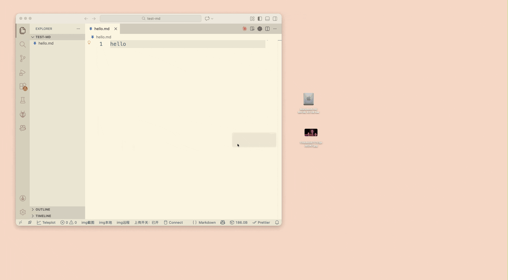

我有个一个习惯，无论是写博客还是写文档，我都喜欢多放图片，因为图片能大大提升文章的可读性和趣味性，一图胜千言。

很多Markdown爱好者都喜欢使用Typora这款Markdown编辑器，因为它有一个非常好用的功能：每当你在Markdown文件中插入图片用Typora写markdown时，图片会自动保存在与markdown文件同名的文件夹中，极大地方便了图片管理。

但是VSCode默认并不支持这种功能。 于是我写了一个插件，可以让VSCode也实现类似的功能，而且完全开源，免费使用。

## 功能介绍

- 自动计算图片哈希值，避免重复图片存储
- 根据Markdown文件的名称，自动创建图片文件夹
- Typora式的图片管理体验, 完全开源

## 使用方法

每当你在markdown文件中插入图片时，图片就会自动保存在与markdown文件同名的文件夹中，方便管理和查找。

## 插件市场安装链接

https://marketplace.visualstudio.com/items?itemName=zhaoolee.markdown-assets-dir

## GitHub开源地址

https://github.com/zhaoolee/markdown-assets-dir

