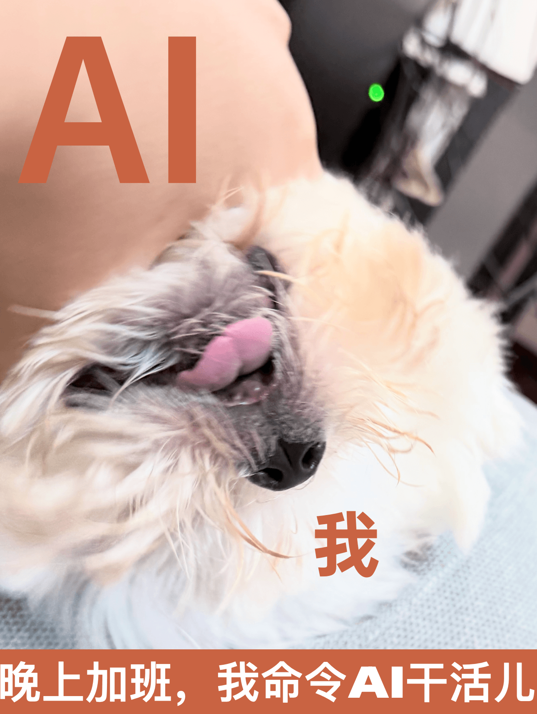
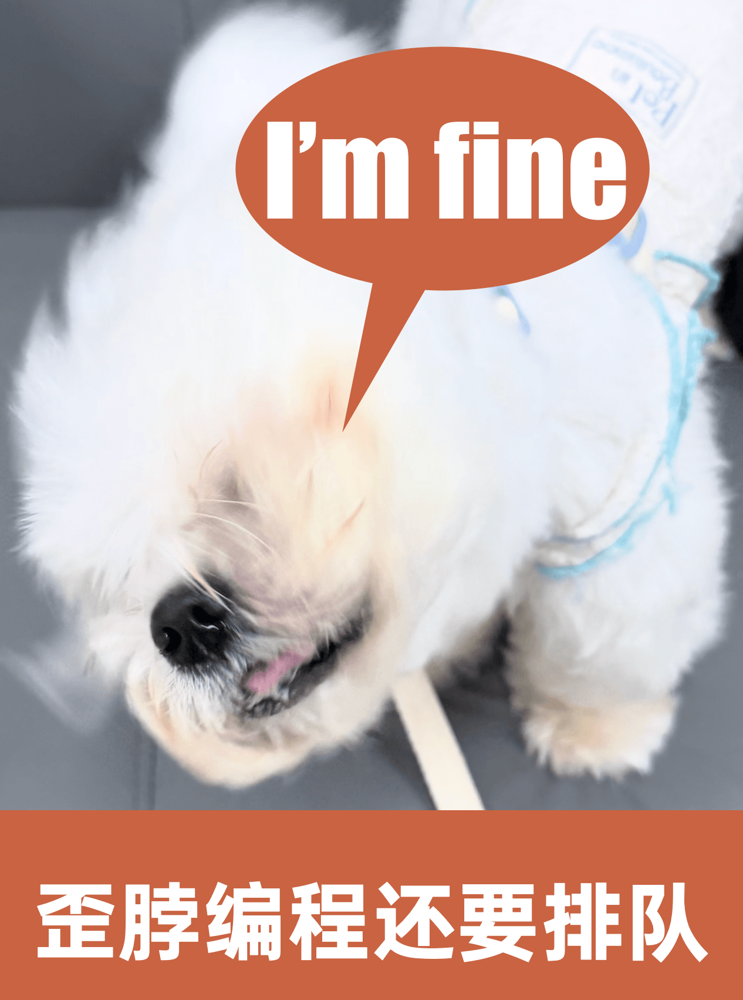

最近开发组开始**鼓励**加班，于是有老哥一边玩手机，一边vibe coding，**理想很丰满，现实很骨感**，简单的问题还好，复杂的bug依赖AI，就是纯粹的消磨时间。

AI为了解决bug，会把工程改的乱七八糟（主要是shi山代码历史悠久，没人愿意动，AI还不懂**代码能跑就别动硬道理**）。

时间消耗到开发排期的最后时刻，还是要人类程序员上手，**一行一行读代码，一点一点找bug**...

程序员：**自从用了AI，加班的频率越来越高了**

AI：**脏活儿你不干难道我来干**。

有了AI，**公司开始鼓励大家跨界**，比如让**设计师搞前端，前端搞后端，后端搞运维，然后都开始 vibe coding**...

这可苦了负责做代码审查的人，功能确实也完成了，但是**能用5行代码完成的功能，实际用了几百行代码**，还有一些没必要改的文件也被改了。

上线的时间也近在眼前，**如果退回去重改，就要拉着所有人加班，为了能早点儿上线下班，只能合并这些能跑的代码**，最后工程质量越来越差，维护成本越来越高。

为了能用上AI，公司开了量大管饱的GLM MAX套餐，然后通过 https://www.newapi.ai/en 像二道贩子一样，为每个人分配key。

理论上降低了成本，但其实GLM 有并发限制，上班的时候如果大家一起用，就得排队，**用出了六十年代大型机的感觉**，每个人只能用一小会儿，运行完任务，再分给其它人。

以前是通过终端运行程序，现在是通过Claude code收发指令，**历史与现代过于相似**。

AI是很不错的工具，这个工具解决了一些编程问题，又带来了新的工程问题，它能放大人类的**智慧**，也能放大人类的**小聪明**。

Vibe coding其实一直存在，**以前是碳基，一个团队来写，现在是硅基，一组Agent来写**；

不过**碳基的Vibe coding是有人担责的，而硅基的Vibe coding无人担责**。这对于喜欢压实的领导非常不友好。所以，到了最后，还是要找碳基的程序员来审核代码（背锅），**以前是拿钱干活儿，现在是拿钱背锅**。