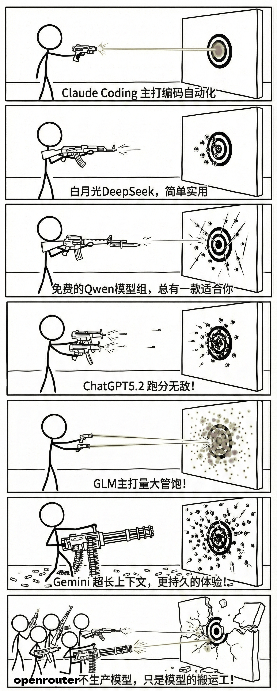
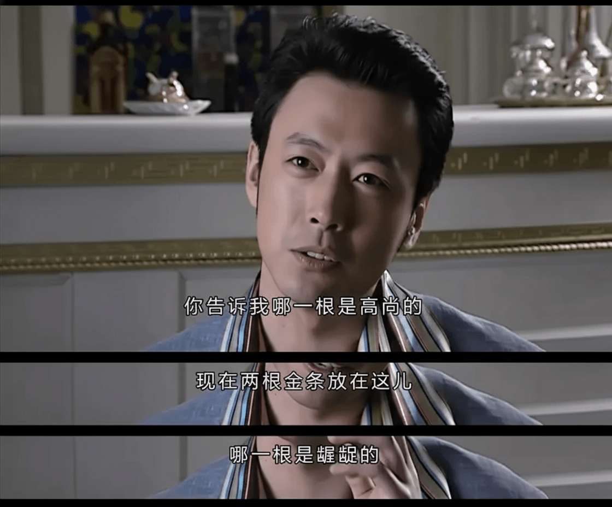
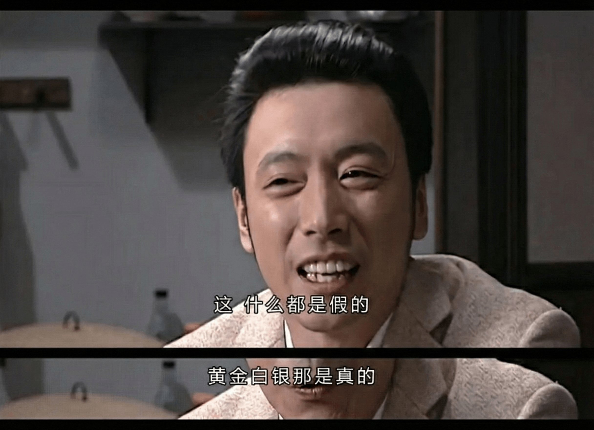

最近在尝试各种模型，发现连一向不挑食的Google也要通过验证信用卡，才能使用最强大的Banana pro生图模型了。

反而作为二道贩子的OpenRouter不挑食，只要缴纳一定的过路费，就能稳定使用Claude， banana pro等超级紧俏的模型，一切加钱可得！果然还是二道贩子贩子最赚钱！

最近Openrouter还发布了各个模型的统计年报，俨然有了各大模型的官方入口的架势。

我最近开了Gemini pro的会员，发现依然限制重重，比如每张合成的图片，右下角都自带一个小水印（没错，即使你是pro会员，也无法移除水印），你想移除水印，要么自己去小网站上传处理，要么就以API的方式调用，API就要想办法搞定海外信用卡，搞不定海外信用的话，就只能求助与OpenRouter。

OpenRouter作为一个二道贩子，能卖的这么好，归根到底还是各大模型供应商，出于一些考量，不能直接卖到中国市场，又要赚中国的市场的钱，最后让中国用户承担了额外的5%费用，养肥了OpenRouter。

虽然各路媒体都在吹AI取代人工，讨论哪些岗位不能被取代，对此OpenRouter回应到，二道贩子无法被取代，二道贩子永远是赚的最多的！

