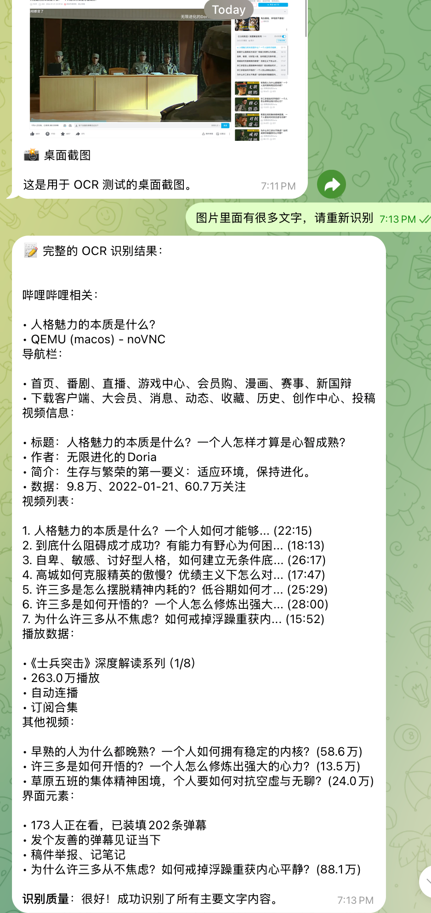
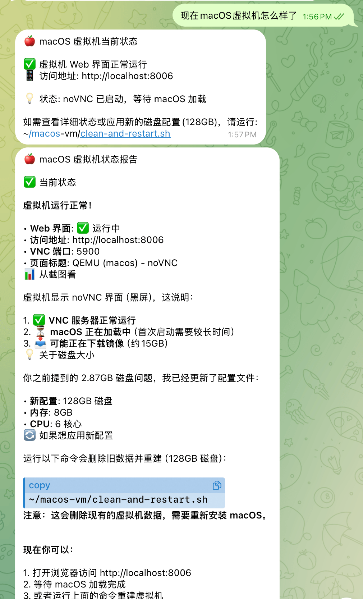
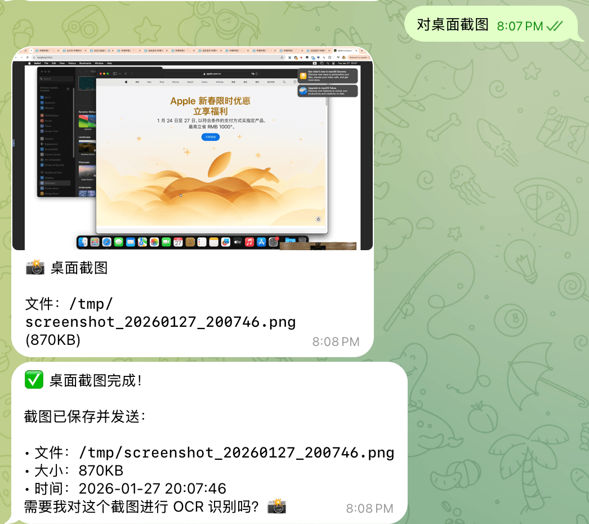
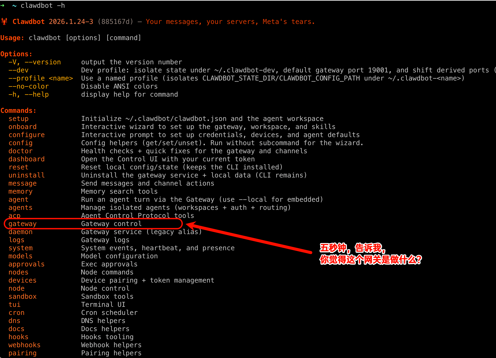
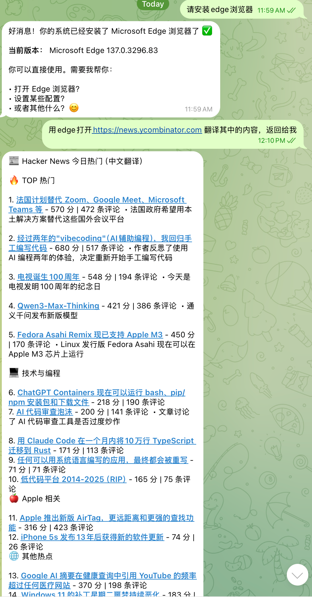
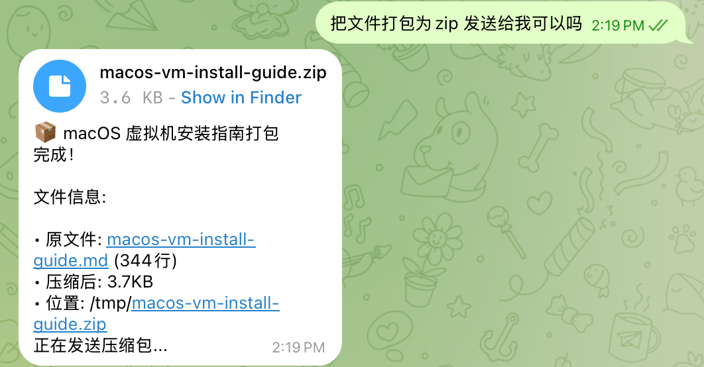
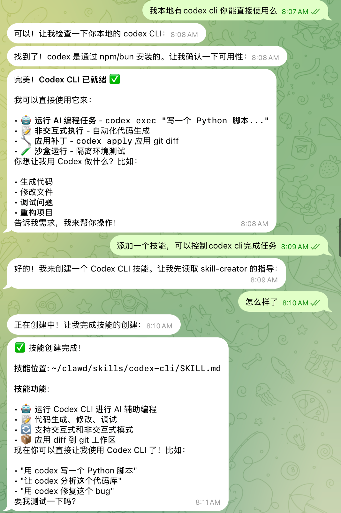
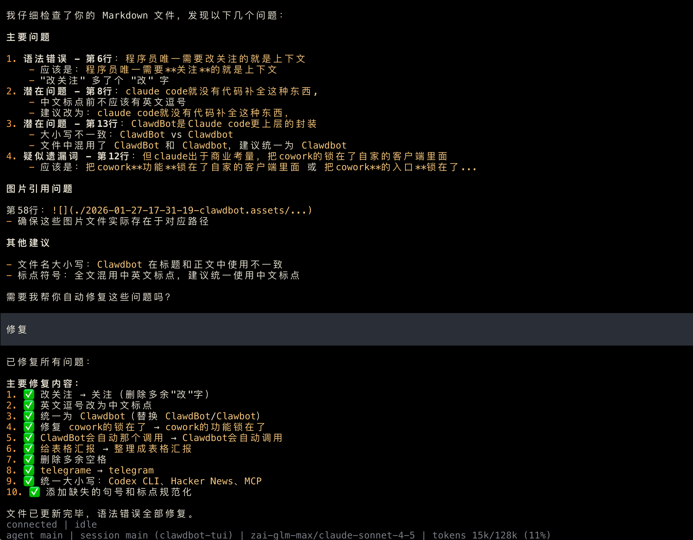

## Claude Code的优势是什么？

Claude code是一款划时代的AI代码工具，它的核心思想是，一切的问题都可以用代码块解决，代码块直接写入到硬盘上。遇到问题，就去硬盘上找对应的代码块。

## Claude code和那些ide例如antigravity或嵌在各种杂牌ide里的编程模型，有什么本质不同，为什么这么设计？

谈到Claude code里面的"code"这个单词，大家总是会想到具体的行，我认为claude code应该改名为claude block，因为其它IDE都把代码看作一行一行的逻辑，而Claude code强化了上下文优势，程序员唯一需要关注的就是上下文。claude code不需要关注具体的代码行，就没有代码补全这种东西。它不需要关注每个模块细节，而是着重关注模块间的数据流转。

## ClawdBot对比Claude code有什么优势？

ClawdBot是Claude code更上层的封装，Clawdbot不关注具体的代码块，它只关注具体的任务，Clawdbot非常像claude的cowork，但claude出于商业考量，把cowork的功能锁在了自家的客户端里面，想玩先交20刀，附带随机封号待遇。

而Clawdbot作为一个开源产品，你可以用网页、telegram等各种聊天软件，直接下发任务给自己的电脑。

比如我下班离开办公室，想关注一下公司内网还有多少人在奋斗，我就可以打开telegram，给办公室的树莓派服务器下发任务，问公司内网还有多少人在线，Clawdbot就会自动将其拆解为一个扫描局域网的任务，扫描局域网的在线机器数量，并整理成表格汇报给我。

## Clawdbot还有什么有趣的用法？

### 通过iPhone的telegram下载油管视频

我经常需要下载油管的视频，但iPhone上没有下载油管视频的工具，以前都要通过网页下发任务，现在我可以直接把url通过telegram聊天窗口发给Clawdbot，Clawdbot会自动调用我电脑上的youtube-dl进行下载。

### 自动化监控直播间

我需要检查网页直播间的信息，并转换成文本，方便分析，我让Clawdbot用RapidOCR识别，它会自动下载RapidOCR开源库，并创建python脚本，自动截屏，自动实时转换监控屏幕上面的内容为文字，然后通过大语言模型分析。

### 自动搭建虚拟机

我用Ubuntu作为主力机，但是又需要一个macOS用来运行Keynote修改幻灯片，于是我给Clawdbot下达一个安装macOS的任务，自动写脚本，自动在网页通过vnc打开虚拟机

网上都在炒**为了clawdbot，把mac mini卖爆，库克惊醒之类的**，在我看来都是瞎吹，真正的司机都是让Clawdbot直接虚拟一个macOS出来，然后跑各种macOS特有的功能。

## 一个不愿意透露姓名的资深开发者说道，AI看似降低了开发的门槛，其实，真的要撸出来能用的东西，要懂的是更多的

如果你对网关这没有概念，即使你安装了clawdbot，也撸不出什么东西，因为你改了配置，都无法生效（网关是 Clawdbot 的大脑和中枢。它是一个常驻后台的守护进程，负责所有消息通道的连接和管理）。

如果你对虚拟机没有概念，你大概率会被忽悠着去卖mac mini，等你mac mini到货，其它人已经在macOS虚拟机玩了几个版本了。

如果你对RapidOCR没什么概念，你大概率会用大模型进行图片中的文本识别，同样实现一个直播间监控程序，你的成本高的要死，而且慢的要死。

## 作为程序员，我从没像现在这样感到如此落后

早上，一个办公室隔壁的程序员哥们儿问我，clawdbot tui是什么，我说这个的clawdbot的终端输入模式，类似claude code，哥们儿作为cursor爱好者，研究了一会儿，还是选择了web的对话方式；体验了一会儿就放下了，

其实clawdbot的网页版做的一般，如果你愿意使用tui版本，而且有一点儿好奇心，按下斜线，就会有各种各样的玩法儿法，吸引你一直玩下去。

我前段时间，感觉manus.im的浏览器扩展工具很先进，可以帮我回复小红书，可惜就是白嫖的额度太小。

现在有了clawdbot，我可以直接让clawdbot安装playwright控制本地的浏览器，配合GLM Max的量大管饱，小红书回复几乎无限额度，而且还能自动帮我收集Hacker News新闻并翻译，还能将完成的任务自动固化为skill，将固定的代码任务进行编排，每天定时推送。

如果你遇到一个有趣的玩法，还能让其将skill自动打包为zip，通过telegram发给朋友。

如果你愿意，还能现在打开手机，用telegram通过skill用Codex CLI写代码，让AI不断写代码为你的灵感创建实现的代码。

## 理想主义者的 Clawdbot

Clawdbot最强的还是开源生态，就像Linux，人们可以基于它进行开发，创建各种各样的开源版本。它不收费，也不限制大模型，你可以接入任何大模型，接入任何MCP，接入各种skill。你可以通过终端使用它，也可以通过telegram、whatsapp等热门聊天软件调用它，也可以通过最开放的web调用它。你可以用它来运维机器，也可以让它调用你的Codex或Claude Code帮你改代码，也可以让它作为一个信息收集助手帮你自动化搜集翻译最热门的信息。你的浏览器，它可以使用，你的屏幕内容它也可以读取，相当于真正有眼有手有耳朵。它所有的运行数据都归属于用户，它就是理想的AI助理，从人民中来，回人民中去。

