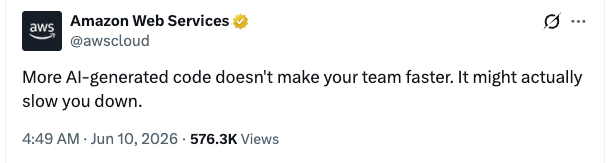
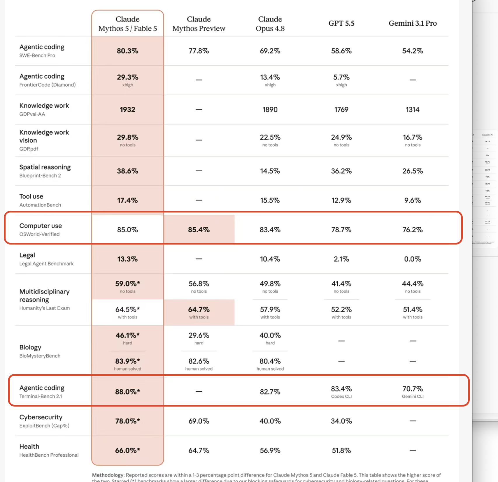
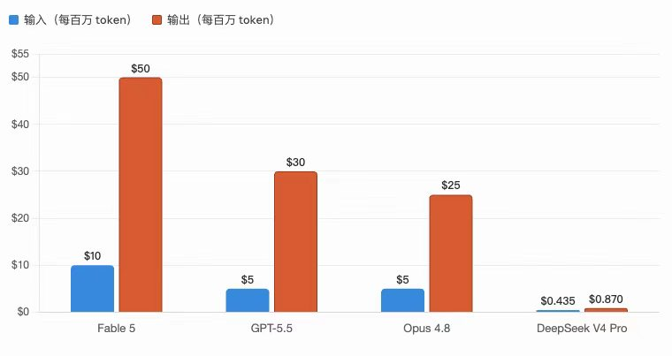
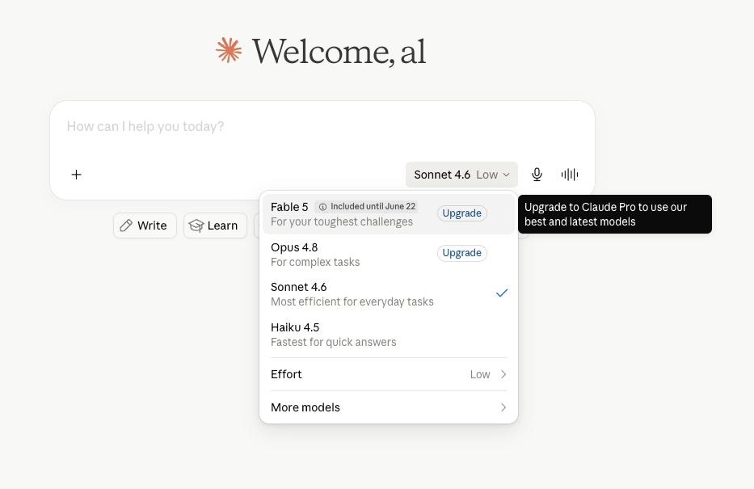

> **我**：那个 Claude 5 发布了，你用上了么？
> **朋友**：我的号被封了，还在等解封。

比较妙的是，今天 AWS 官方 X 账号发文：

更多地使用 AI 生成代码，并不能让你的团队变得更快。

它也许会让你变得更慢。

亚马逊是当初第一个借 AI 当借口大裁员的，有脸讲这个。

估计是被天量金币构建的 AI 公司上市影响到股价了。

## 最关注的 Computer use 和 coding 提升并不明显，但价格遥遥领先

现在的 AI 其实能做的事依然非常有限。

比如你想找人帮你代打游戏，让 AI 去做的话，大概率是不太行的。

让它帮你打开 DFO，领个复活币都非常费劲。

所以这个模型目前还是在编码方面更加擅长。

现在的 AI，与其说是大语言模型，不如说是编程模型。

编程模型最重要的两个点：

1. Agent coding
2. Computer use

在以上两个点上，它的提升依然非常有限。

针对编程能力，其实有很多测试基准。

Claude 很鸡贼地把提升比较高的基准放在了前面，把提升比较少的基准放在了后面。

## 想体验，先充值 20 刀，然后喜提封号

Claude 并没有为普通用户提供试用额度。

需要至少充值 20 刀，才能够体验它最新的 Claude 5 模型。

而且只有在本月 22 号之前可以使用。

这算是精准筛选用户了。

如果你充了值发现它不好用，你也应该说好用。

否则显得自己这个充值行为非常的呆。

而且 Claude 非常不爽被订阅用户薅羊毛。

Claude 5 只让订阅用户蹭蹭。

你要爽，最终还是只能用 API。

## 玩阴的，A除最畜生的一代模型，把A除的虚伪和邪恶体现的淋漓尽致

虽然 Claude 依然是目前最强的编码模型之一。

但是 Claude 5 发布后，被很多人扒出了阴招。

掺水，降级到 Opus 4.8。

下毒。

如果发现用户在搞 LLM，就会在未通知的情况下，偷偷通过修改提示词、修改向量等手段降智。

## 要上车 Claude 5 么？

如果不是公司掏钱，个人用户每月充值 20 刀，可能是最佳的长线选择。

前提是你的账号没有被封。

虽然 A 除非常畜，但是它的整体产品交互以及产品思考依然是顶级的。

可以批判性地学习和使用。

但是如果 DeepSeek 或者 ChatGPT 能够帮你完成大多数的工作，体验 Anthropic Claude 5 其实也不是非常迫切。

等降价吧！

ChatGPT 应该会在本月 22 号之前发布自己的新模型，也可能是 ChatGPT 5.6，也可能是 ChatGPT 6。

如果 ChatGPT 新版本能在编码能力上与 Claude 5 非常接近。

价格也没有太大的波动。

相信一定能吸引到更多的用户从 Claude 转向到 ChatGPT 的 Codex。

只要 Codex 不涨价，Codex 就是程序员最好的酒肉朋友。

## AI 帮我们解决了哪些问题？带来了哪些问题？

1. 写代码
   可以提高程序员的编码效率。

   但审核代码依然需要大量的精力与时间。

   编码过程中，也需要大量的 prompt 对 AI 实现的代码进行精修及检验。

   同时也让程序员审核代码变得更累，并为裁员带来了更好的借口。

2. 自媒体内容生产
   好的地方在于，确实让自媒体的内容生产变得自动化。

   同时也带来了垃圾新闻满天飞的问题。

3. 生图
   以前生图需要大量的建模与人工成本。

   现在可以用极低的成本，生成让人惊艳的图片效果。

   同时也带来了假图片满天飞的问题。

4. 普通用户体验
   由于大模型厂商的补贴，我们可以用比较低的成本，使用到其实成本很高的 AI。

   同时硬盘、内存和显卡的价格全部爆炸。

   导致装一台电脑都很困难。

## 小结

Claude 5 这种高昂的定价，是能够写入互联网历史的。

如此高昂的定价，导致普通用户根本无法使用。

同时，企业用户也望而生畏。

即使是财大气粗的微软，都不得不限制员工使用 AI 的额度。

我希望 Anthropic 早点上市。

让市场检验昂贵的 AI 到底能够为社会创造多大的价值。

也检验万亿 IPO 能够给市场带来多大的惊喜。

你愿意每个月花多少钱用来购买 AI 服务？
